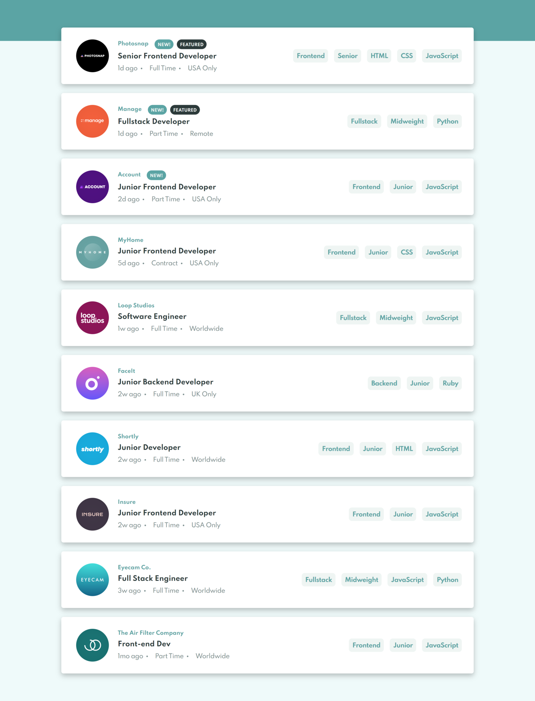

# Welcome! 👋

## Live

[Live]()

## The Challenge
Your users should be able to:

- View the optimal layout for the site depending on their device's screen size
- See hover states for all interactive elements on the page
- Filter job listings based on the categories selected

## Built With
This app is buil with react.js and css modules 

## What I Practice
I practice my undestanding of how works `useState()`, `useEffect()` and `useContext()`

# Frontend Mentor - Job listings with filtering